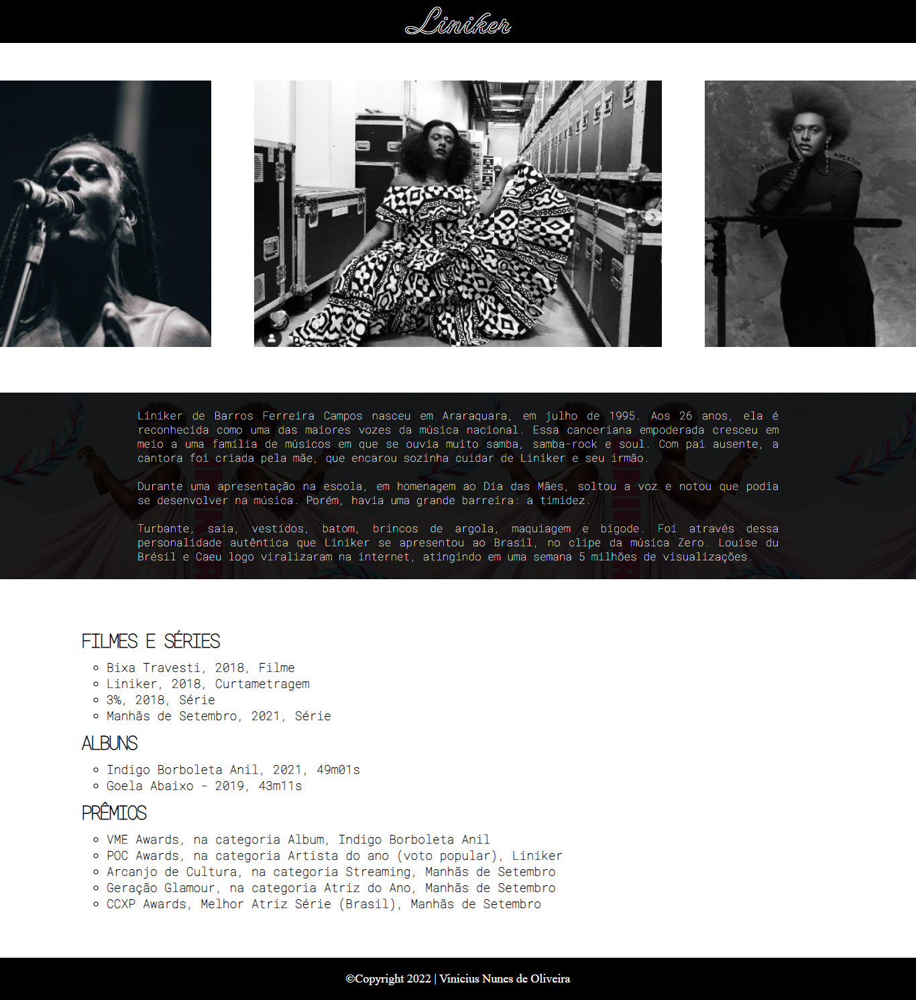

# **LINIKER BARROS**

[Clique aqui](https://viniciusnunes137.github.io/atividade01/) para acessar o site

 

## **SOBRE**
- Site realizado com o intuito de homenagear um personagem/artista. A artista escolhida para esse projeto foi a Liniker Barros, uma cantora trans reconhecida como uma das grandes vozes brasileiras.
    
- - Foi proposto esse projeto pelo professor de Linguagem de Marcação com a finalidade de estruturar nosso primeiro site com o (header, main e footer) e utilizar a tag de ul e li para criação de tópicos.

## **TECNOLOGIAS APLICADAS**
- HTML5
- CSS3

## **FERRAMENTAS**
- VSCODE
- GITHUB / GIT

## **CONCEITOS APLICADOS**
- DISPLAY (FLEX)
- TÓPICOS (UL/LI)
- UTILIZAÇÃO DE TAGS PARA ALINHAMENTO (PADDING, MARGIN, POSITION)
- @MEDIA (RESPONSIVIDADE)

## **AUTOR**

- [VINICIUS NUNES](https://github.com/VINICIUSNUNES137)
